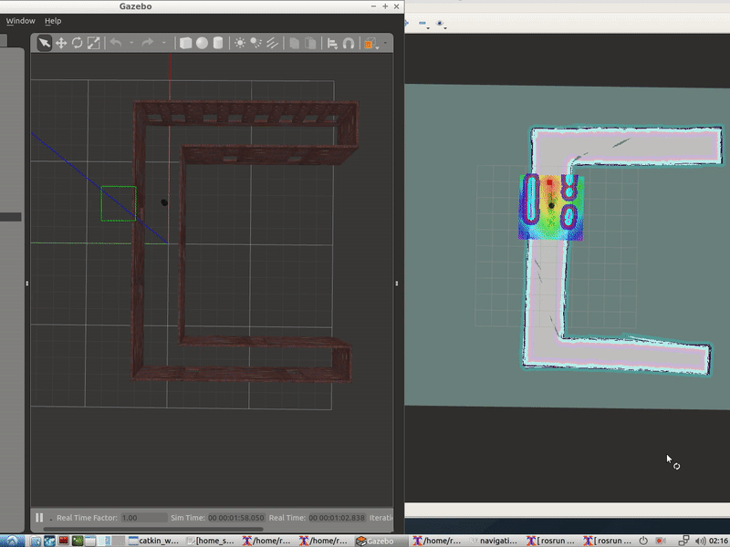
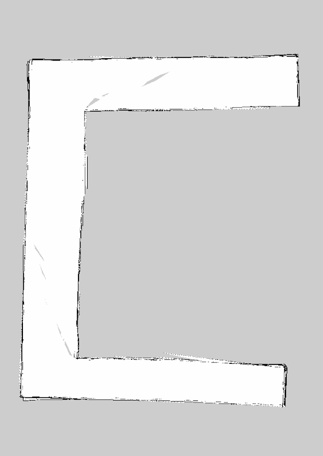
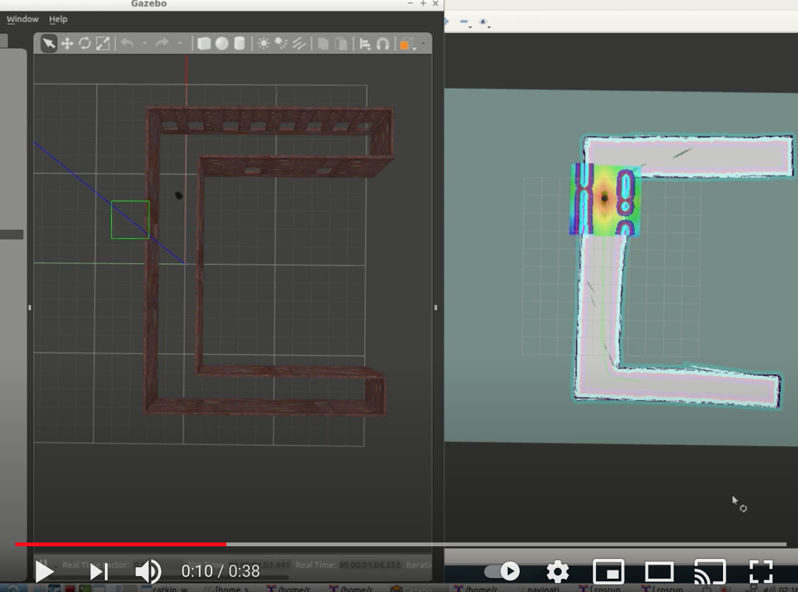

[](https://www.udacity.com/robotics)

# Home service robot
Project 5 of the Udacity Robotics Software Engineer Nanodegree. In this project, a home service robot that will autonomously map an environment and navigate to pick-up zone, pick up the cub and deliver it to drop-off zone.



## Description
Steps in this project to simulate a home service robot

### Step1. Simulation Setup    
To program home service robot, I need to interface it with different ROS packages.  

1. **gmapping**: With the gmapping_demo.launch file, you can easily perform SLAM and build a map of the environment with a robot equipped with laser range finder sensors or RGB-D cameras.

2. **turtlebot_teleop**: With the keyboard_teleop.launch file, you can manually control a robot using keyboard commands.

3. **turtlebot_rviz_launchers**: With the view_navigation.launch file, you can load a preconfigured rviz workspace. You’ll save a lot of time by launching this file, because it will automatically load the robot model, trajectories, and map for you. 

4. **turtlebot_gazebo**: With the turtlebot_world.launch you can deploy a turtlebot in a gazebo environment by linking the world file to it.

**Packages and Directories**
You’ll install these packages and create the directories as you go through the project.

- *worlds*: Inside this directory, I stored gazebo world file and the map generated from SLAM.
- *shell_scripts*: Inside this directory,I stored shell scripts.
- *rvizConfig*: Inside this directory, I stored customized rviz configuration files.
- *pick_objects*: I wrote a node that commands the robot to drive to the pickup and drop off zones.
- *add_markers*: I wrote a node that model the object with a marker in rviz.

```bash
$ mkdir -p ~/catkin_ws/src
$ cd ~/catkin_ws/src
$ catkin_init_workspace
$ cd ..
$ catkin_make
$ sudo apt-get update
$ cd ~/catkin_ws/src
$ git clone https://github.com/ros-perception/slam_gmapping
$ git clone https://github.com/turtlebot/turtlebot
$ git clone https://github.com/turtlebot/turtlebot_interactions
$ git clone https://github.com/turtlebot/turtlebot_simulator
$ cd ~/catkin_ws/
$ source devel/setup.bash
$ rosdep -i install gmapping
$ rosdep -i install turtlebot_teleop
$ rosdep -i install turtlebot_rviz_launchers
$ rosdep -i install turtlebot_gazebo
$ catkin_make
$ source devel/setup.bash
```

### Step2. SLAM Testing
To manually perform SLAM by teleoperating the robot. The goal of this step is to manually test SLAM.

Use **xterm** terminal in the script here.
```bash
$ sudo apt-get install xterm
```
**test_slam.sh**
```bash
#!/bin/sh
xterm  -e  " roslaunch turtlebot_gazebo turtlebot_world.launch " &
sleep 3
xterm  -e  " roslaunch turtlebot_gazebo gmapping_demo.launch " &
sleep 3
xterm  -e  " roslaunch turtlebot_rviz_launchers view_navigation.launch " &
sleep 3
xterm  -e  " roslaunch turtlebot_teleop keyboard_teleop.launch "
```

After navigating the robot around multiple times, saved it using:
```bash
$ rosrun map_server map_saver -f <map-name>
```
The corresponding map looks as follows:


### Step3. Localization and Navigation Testing
The next task of this project is to pick two different goals and robot's ability to reach them and orient itself with respect to them.

I used the ROS Navigation stack, which is based on the *Dijkstra's*, a variant of the Uniform Cost Search algorithm, to plan the robot trajectory from start to goal position. Interfaced with this navigation stack  and sent a specific goal for the robot to reach while localizing itself with *AMCL*.

**test_navigation.sh**
```bash
#!/bin/sh
xterm  -e  " roslaunch turtlebot_gazebo turtlebot_world.launch " &
sleep 3
xterm  -e  " roslaunch turtlebot_gazebo amcl_demo.launch " &
sleep 3
xterm  -e  " roslaunch turtlebot_rviz_launchers view_navigation.launch "
```
### Step4. Reaching Multiple Goals (pick-objects)

To test robot's capability to reach multiple goals, as specified by the program (and not manually), I created `pick_objects` package and specifically `pick_objects.cpp` function. This can be tested following script which launches turtlebot, AMCL, rviz and pick_objects node:

**pick_objects.sh**
```bash
#!/bin/sh
xterm  -e  " roslaunch turtlebot_gazebo turtlebot_world.launch " &
sleep 3
xterm  -e  " roslaunch turtlebot_gazebo amcl_demo.launch " &
sleep 3
xterm  -e  " roslaunch turtlebot_rviz_launchers view_navigation.launch " &
sleep 3
xterm  -e  " rosrun pick_objects pick_objects "
```

### Step5. Modeling Virtual Objects(add-markers)
To model a virtual object with markers in rviz, I created `add_markers` package and specifically `add_markers.cpp` function. This can be tested following script which launches turtlebot, AMCL, rviz and add_markers node:

**add_markers.sh**
```bash
#!/bin/sh
xterm  -e  " roslaunch turtlebot_gazebo turtlebot_world.launch " &
sleep 3
xterm  -e  " roslaunch turtlebot_gazebo amcl_demo.launch " &
sleep 3
xterm  -e  " roslaunch turtlebot_rviz_launchers view_navigation.launch " &
sleep 3
xterm  -e  " rosrun add_markers add_markers "
```


### Step6. Home Service Robot
To simulate a full home service robot capable of navigating to pick up and deliver virtual objects, communication was established between the `add_markers` and `pick_objects` nodes via **"/visualization_marker"** topic. The entire package can be launched using:

**home_service.sh**
```bash
#!/bin/sh
xterm  -e  " roslaunch turtlebot_gazebo turtlebot_world.launch " &
sleep 3
xterm  -e  " roslaunch turtlebot_gazebo amcl_demo.launch " &
sleep 3
xterm  -e  " roslaunch turtlebot_rviz_launchers view_navigation.launch " &
sleep 3
xterm  -e  " rosrun add_markers add_markers " &
sleep 3
xterm  -e  " rosrun pick_objects pick_objects "
```


## Prerequisites/Dependencies

1. ROS (Melodic or Kinetic), Gazebo on Linux
    * [Click here for Gazebo download and installation instructions.](http://gazebosim.org/)
    * [Click here for ROS installation instructions.](http://wiki.ros.org/ROS/Installation)

2. CMake & g++/gcc
    * make >= 4.1(mac, linux), 3.81(Windows)
        * Linux: make is installed by default on most Linux distros
        * Mac: [install Xcode command line tools to get make](https://developer.apple.com/xcode/features/)
        * Windows: [Click here for installation instructions](http://gnuwin32.sourceforge.net/packages/make.htm)
    * gcc/g++ >= 5.4
        * Linux: gcc / g++ is installed by default on most Linux distros
        * Mac: same deal as make - [install Xcode command line tools](https://developer.apple.com/xcode/features/)
        * Windows: recommend using [MinGW](http://www.mingw.org/)


## The Video
Click on the image to watch the video or click [here](https://youtu.be/AVQTfviWNVY). You will be redirected to YouTube.[](https://youtu.be/AVQTfviWNVY)

## License
Original version of the license of this repository can be found here:
https://gist.github.com/laramartin/7796d730bba8cf689f628d9b011e91d8
